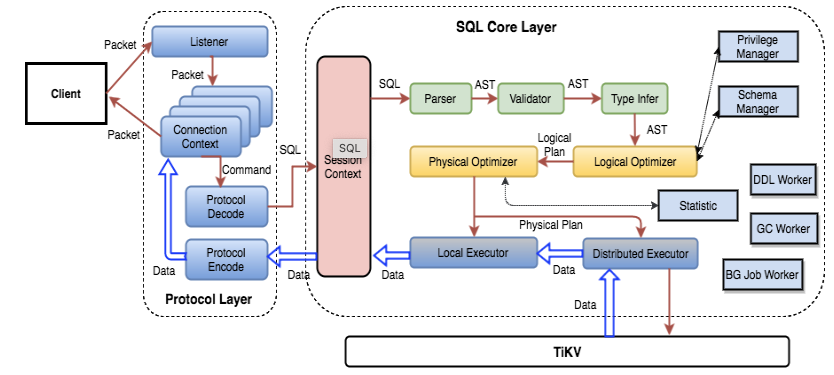

# KipSQL


> build the SQL layer of KipDB database.
> 

# SQL layer 需要作什么

- SQL API：用户接口，接收来自外界的请求。
- 解析器（Parser）：将SQL文本转换为抽象语法树(AST)。
    - 语义分析：AST树合法性校验
- 优化器（Optimizer）
    - 逻辑优化：将AST树转换为优化的逻辑查询计划。
    - 物理优化：将逻辑查询计划转换为[物理查询计划](https://www.zhihu.com/search?q=%E7%89%A9%E7%90%86%E6%9F%A5%E8%AF%A2%E8%AE%A1%E5%88%92&search_source=Entity&hybrid_search_source=Entity&hybrid_search_extra=%7B%22sourceType%22%3A%22article%22%2C%22sourceId%22%3A%22557876303%22%7D)，供集群中的一个或多个节点执行。
- 执行器Executor：通过向底层kv存储发出读写请求（发送到事务层），来执行物理计划。

流程图可以参考TIDB的，非常明了。



# SQL引擎设计

### 期望支持的SQL语法类型

- 数据定义语言DDL（Data Definition Language）：对数据库中资源进行定义、修改和删除，如新建表和删除表等。
- 数据操作语言DML（Data Manipulation Language）：用以改变数据库中存储的数据内容，即增加、修改和删除数据。
- 数据查询语言DQL（Data Query Language）：也称为数据检索语言，用以从表中获得数据，并描述怎样将数据返回给程序输出。

### Parser

实现解析器的逻辑比较复杂，项目初始阶段可以先使用现成的库

parser选型

[https://github.com/sqlparser-rs/sqlparser-rs](https://github.com/sqlparser-rs/sqlparser-rs)

```rust
use sqlparser::dialect::GenericDialect;
use sqlparser::parser::Parser;

let sql = "SELECT a, b, 123, myfunc(b) \
           FROM table_1 \
           WHERE a > b AND b < 100 \
           ORDER BY a DESC, b";

let dialect = GenericDialect {}; // or AnsiDialect, or your own dialect ...

let ast = Parser::parse_sql(&dialect, sql).unwrap();

println!("AST: {:?}", ast);
```

但sqlparser-rs库只能提供词法分析和语法分析，生成查询树，不能进行语义分析，也就是合法性校验。因此我们将 sqlparser库进行封装，增加语义分析功能

## 语义分析

- 及时校验报错
    - 标识符resolve
        - 数据库、表、字段、属性存在性、正确性校验
    - 语义逻辑限制
        - group by和select的item的关系
        - distinct和order、group by的关系
        - select item是否在source relation中
        - 。。。
    - SQL片段表达式的正确性
        - 分别分析各个最小表达式返回类型、表达式正确性，例如where expr1 = subquery 就要求验证 “=” 两边的结果类型可比较
        - 这些表达式组合后的正确性，例如 expr1 and expr2 就要求 expr1/2 表达式的返回结果必须是boolean型才能 进行 AND操作
        - 。。。
- 分析结果，作为可选参数传给 生成 逻辑计划/物理计划 的planner，作为参数进一步被转换应用
    - 例如可以用functionExpression来转换生成具体的 函数调用，这个过程需要知道 func(A,B) C的参数类型、返回类型等，才能对应调用具体的函数

## Optimizer

### 优化器概述


### **查询优化器的核心目的是**

- 根据query生成的plan，在可接受时间内，快速找到一个语义等价的、查询最高效的 查询执行计划

### **其目标最核心的三个要点，尽可能同时满足**

- 时间可接受的，快速的
- 语义等价
- 查询最高效的

未来实现这个目标，学术界和工业界在不断努力，其中我们常说的查询优化器类型有CBO、RBO、HBO这些。

HBO（Heuristic-Based Optimizer）和RBO（Rule-Based Optimizer）都是数据库查询优化器的早期实现，它们都有一些局限性，这些局限性导致它们无法满足当今复杂的数据库系统的需求。这就是为什么需要引入CBO（Cost-Based Optimizer）。
HBO使用启发式算法来选择最优的查询执行计划。它将查询优化过程视为一个搜索问题，尝试使用一些经验法则来指导搜索。然而，这些启发式规则可能不适用于所有情况，导致HBO无法找到最优的查询执行计划。

RBO是另一种优化器，它使用一系列的规则来指导查询优化过程。这些规则通常是基于查询语法和数据模式的，并且不考虑查询的复杂度和数据分布等因素。因此，RBO通常只适用于简单的查询，对于复杂的查询无法找到最优的执行计划。

CBO引入了代价模型的概念，它基于查询代价来选择最优的查询执行计划。代价模型是基于统计信息和数据库结构的，并且考虑了查询的复杂度和数据分布等因素。CBO使用代价模型来评估每个可能的查询执行计划的代价，并选择代价最小的执行计划作为最终的执行计划。因此，CBO能够处理更加复杂的查询，并且能够找到最优的查询执行计划。
而CBO核心是基于代价的来展开的， 如果代价无法估算正确，那么整个优化结果就是错误的。而估算代价的过程也是个复杂的过程，想要有限时间内，快速从所有的plan tree选择最优解 已经被证明过是个NP-Hard问题。
这就导致CBO始终没有一个最完美、最全面、最准确的解决方案。
**对于一个CBO而言，其核心组件有3个，业界把这3个地方抽象为如下图，这也是近年来工业界、学术界的努力聚焦在的细分领域**

- **Cardinality Estimation 基数估算**
- **Cost Model 代价模型**
- **Plan Enumeration 计划枚举搜索**


**如上图，查询优化器第一步就是有做好基数估算和代价模型。**

- 基数是指一个operator操作数据的规模，例如TableScan这种operator，他的基数就是表的数据量，如果是hashjoin这种operator，那么就是具体数据的NDV个数。如果基数错误，这就导致代价估算的基数就错了，评估得到的代价肯定也是错误的。例如分不清大小表，把大表broadcast到各个节点，小表进行分区join。
- 代价模型是指各种operator在各种数据的计算代价公式，例如tableScan 1行需要多少时间，filter 1一行需要多少时间，是否需要一些影响因素系数等等，不同的代价公式，会得出不同的代价结果，导致选出来的plan千差万别。

**其次就是plan enumeration，其作用就是在众多plan中，快速选取cost代价最小的plan** 。

- 由于枚举plan这个过程是随着join表个数，搜索空间大小会指数变大，全部罗列出plan在挑选最优plan是不现实的
- 业界通常是使用bottom-up的动态规划办法【System R】、top-down的memorization办法【volcano&cascade系列】、随机join顺序的办法进行【PG 11之前】
- 从历史发展来看
    - 随机join肯定是个概率问题，后期演进空间不大；
    - 而bottom-up的架构，就涉及扩展性和各种迭代开发问题，导致发展缓慢；
    - 目前比较公认的是 top-down的方式，而top-down典型的又volcano 系列和cascade系列的查询优化器
        - 其中volcano的优化器有 早期的Apache calcite
        - cascade系列的早期 MS SqlServer，Columbia，后来columbia合入到PostgreSQL里面。比较新的开源实现是ORCA这个，相对简单。阿里云ADB也是这种cascade架构。

**而针对这三个核心的组件，结合一些公布的学术动态，未来可能得发展方向如下：**

- Cardinality Estimation
    - Learning-based methods 最近两年很多这方面的研究工作
    - Hybrid methods 混合多种方法，互相影响相辅相成
    - Experimental study 更多实验验证这些 方法的有效性和准确性，否则很多研究还停留在学术上
- Cost Model
    - cloud database systems 结合一些云环境上的代价估算，例如多云的运算时间、云环境付费成本
    - learning-based methods 基于一些机器学习的方式估算代价，例如对大量的operator进行训练得到各种输入下，operator的代价情况，以此来估算一个新的query的plan的所有operator 代价的sum总代价
- Plan Enumeration
    - Handle Large queries 对于大查询的一些处理，需要深入研究
    - Learning-based methods 持续研究机器学习的方式，目前主流的还是非机器学习的方案。


经过优化器生成物理计划投喂到执行器

## Executor

执行引擎采用 Volcano 模型

通过优化器得到的物理查询计划树会转换为一个执行器树，树中的每个节点都会实现这个接口，执行器之间通过 Next 接口传递数据。比如 select c1 from t where c2 > 1; 最终生成的执行器是 Projection->Filter->TableScan 这三个执行器，最上层的 Projection 会不断的调用下层执器的 Next 接口，最终调到底层的 TableScan，从表中获取数据。


> 后期可以考虑使用Velox
> 
> 
> Velox 接受一棵**优化过的** `PlanNode` Tree，然后将其切成一个个的线性的 `Pipeline`，`Task` 负责这个转变过程，每个 Task 针对一个 PlanTree Segment。大多数算子是一对一翻译的，但是有一些特殊的算子，通常出现在多个 Pipeline 的**切口**处，通常来说，这些切口对应计划树的**分叉处**，如 `HashJoinNode`，`CrossJoinNode`， `MergeJoinNode` ，通常会翻译成 XXProbe 和 XXBuild。但也有一些例外，比如 `LocalPartitionNode` 和 `LocalMergeNode` 。
> 
> ### velox 的必要性
> 
> 不同数据处理系统之间的主要差异在于
> 
> - 语言前端层面：SQL、dataframe、其他DSL等
> - 优化器
> - 任务划分：分布式场景下如何划分数据/任务
> - IO 层
> 
> 而它们的执行层都是十分相似的
> 
> - 类型系统
> - 数据在内存中表示/layout
> - 表达式求值系统
> - 存储层、[网络序列化](https://www.zhihu.com/search?q=%E7%BD%91%E7%BB%9C%E5%BA%8F%E5%88%97%E5%8C%96&search_source=Entity&hybrid_search_source=Entity&hybrid_search_extra=%7B%22sourceType%22%3A%22article%22%2C%22sourceId%22%3A%22620275762%22%7D)
> - 编码
> - 资源管理原语
> 
> velox就是致力于成为一个通用的执行层：接受经过optimizer优化过后的查询计划，使用本地资源执行查询计划。但是不做SQL parser、optimizer的工作。
> 

## 后续调研工作

table 到 kv 映射关系的处理
[参考TinySQL中TableCodec设计](https://github.com/talent-plan/tinysql/blob/course/courses/proj1-part2-README-zh_CN.md)

优化器的具体实现
[DataFusion Query Optimizer](https://github.com/apache/arrow-datafusion/blob/aae7ec3bdb64bf0346249ccb9e44abdc29880904/datafusion/optimizer/README.md#L4)

[tinysql优化器文档](https://github.com/talent-plan/tinysql/blob/course/courses/proj4-README-zh_CN.md)

第一阶段可以实现一个简单优化器

velox 能否接入KipDB作为存储引擎

# Reference


[TiDB 源码阅读系列文章（五）TiDB SQL Parser 的实现](https://cn.pingcap.com/blog/tidb-source-code-reading-5)

[Facebook Velox 运行机制全面剖析](https://zhuanlan.zhihu.com/p/614918289)

[Velox: Meta’s Unified Execution Engine](https://zhuanlan.zhihu.com/p/620275762)

[TinySQL 实现总结](https://waruto.top/posts/tinysql-impl/)

[揭秘 TiDB 新优化器：Cascades Planner 原理解析](https://zhuanlan.zhihu.com/p/94079481)

[TiDB 源码初探](https://zhuanlan.zhihu.com/p/24564238)

[Push-Based Execution in DuckDB - Mark Raasveldt](https://www.youtube.com/watch?v=MA0OsvYFGrc)

[Push-Based Execution in DuckDB](https://dsdsd.da.cwi.nl/slides/dsdsd-duckdb-push-based-execution.pdf)

[Paper Reading: MonetDB/X100: Hyper-Pipelining Query Execution](https://frankma.me/posts/papers/monetdb-hyper-pipelining-query-execution/)

[查询执行 | Databend 内幕大揭秘](https://psiace.github.io/databend-internals/docs/the-basics/executor-in-query-process/)

[[转][不会游泳的鱼]SQL引擎发表、落地论文总结](https://distsys.cn/d/179-zhuan-bu-hui-you-yong-de-yu-sqlyin-qing-fa-biao-luo-di-lun-wen-zong-jie)

[Apache Arrow：一种适合异构大数据系统的内存列存数据格式标准](https://tech.ipalfish.com/blog/2020/12/08/apache_arrow_summary/)

[TPC-H benchmark of Hyper and DuckDB on Windows and Linux OS - Architecture et Performance](https://www.architecture-performance.fr/ap_blog/tpc-h-benchmark-of-hyper-and-duckdb-on-windows-and-linux-os/)